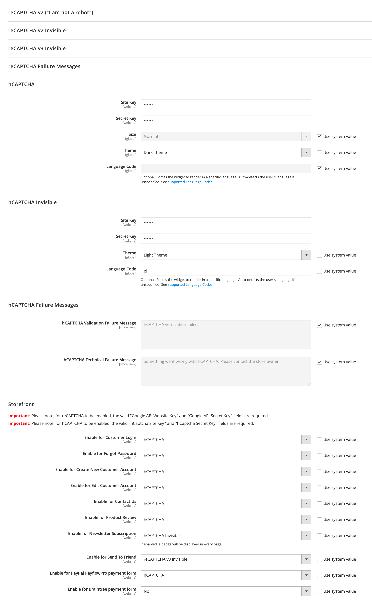

<h1 align="center">grasch/magento-2-hcaptcha</h1>

<div align="center">
  
  <a href="https://GitHub.com/Naereen/StrapDown.js/graphs/commit-activity" target="_blank"></a>
</div>

## Highlight features for Magento 2 HCaptcha
- hCaptcha for your store security.
- hCaptcha works in Frontend pages.
    - Customer Login.
    - Forgot Password.
    - Create New Customer Account.
    - Edit Customer Account.
    - Contact Us.
    - Product Review.
    - Newsletter Subscription.
    - Send To Friend.
    - Checkout/Placing Order.
    - Coupon Codes.
    - PayPal PayflowPro payment form.
- hCaptcha works in Backend pages.
    - Login.
    - Forgot Password.
- Supports visible and invisible hCaptcha.
- Supports REST API and GraphQl validation.
- Compatible with Google reCaptcha. 


 

## How to install Magento 2 HCaptcha

### ✓ Install via composer (recommend)

Run the following commands in Magento 2 root folder:

```
composer require grasch/module-hcaptcha
php bin/magento setup:upgrade
php bin/magento setup:static-content:deploy
```
### ✓ Install via downloading

Download and copy files into `app/code/Grasch/HCaptcha` and run the following commands:
```
php bin/magento setup:upgrade
php bin/magento setup:static-content:deploy
```

### <span style="color:red">Important!</span>
Enable all ```Magento_ReCaptcha``` modules because ```Grasch_HCaptcha``` extension is based on these extensions.

## How to configure?
- Go to Stores -> Configuration -> Security -> Google reCAPTCHA Storefront | hCaptcha Storefront.



## The MIT License
[](https://opensource.org/licenses/MIT)

